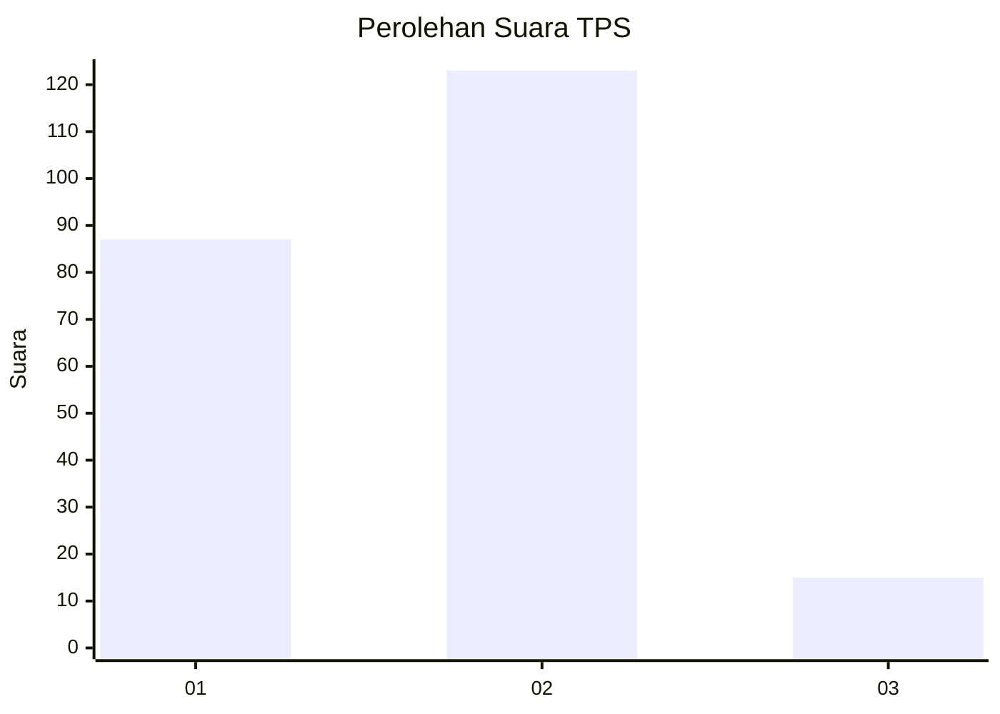

# Hasil

## Grafik

## Tabel

| No. | Nama Paslon    | Suara | Suara (raw) | Persentase |
|:--- |:-------------- | -----:| -----------:| ----------:|
| 1   | ANIES MUHAIMIN | 87    | [87][p-1]   | 38,67      |
| 2   | PRABOWO GIBRAN | 123   | [123][p-2]  | 54,67      |
| 3   | GANJAR MAHFUD  | 15    | [15][p-3]   | 6,67       |

[p-1]: https://github.com/gigit-pemilu/pemilu-2024-32-jawa-barat/blob/main/pilpres/hitung-suara/sub/32-jawa-barat/sub/78-kota-tasikmalaya/sub/06-cibeureum/sub/1005-setiaratu/sub/005-tps/sub/paslon-1.txt
[p-2]: https://github.com/gigit-pemilu/pemilu-2024-32-jawa-barat/blob/main/pilpres/hitung-suara/sub/32-jawa-barat/sub/78-kota-tasikmalaya/sub/06-cibeureum/sub/1005-setiaratu/sub/005-tps/sub/paslon-2.txt
[p-3]: https://github.com/gigit-pemilu/pemilu-2024-32-jawa-barat/blob/main/pilpres/hitung-suara/sub/32-jawa-barat/sub/78-kota-tasikmalaya/sub/06-cibeureum/sub/1005-setiaratu/sub/005-tps/sub/paslon-3.txt

## Foto C Plano

https://sirekap-obj-formc.kpu.go.id/babc/pemilu/ppwp/32/78/06/10/05/3278061005005-20240214-234813--5475ccf2-9496-46d2-8503-924df0ec0dc3.jpg

https://sirekap-obj-formc.kpu.go.id/babc/pemilu/ppwp/32/78/06/10/05/3278061005005-20240214-234916--8a6fdfd9-ce87-479d-868e-a4ad0b0b5ed0.jpg

https://sirekap-obj-formc.kpu.go.id/babc/pemilu/ppwp/32/78/06/10/05/3278061005005-20240214-235003--7bff6f07-831f-495a-9218-60d3107705a8.jpg

## Metadata

| Key        | Value               |
| ---------- | ------------------- |
| Time Stamp | 2024-02-20 17:00:00 |

