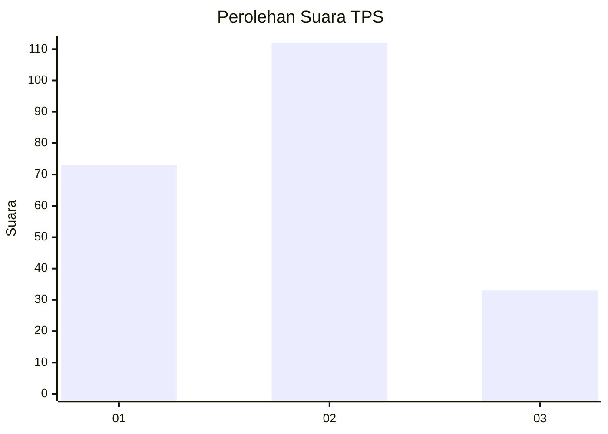
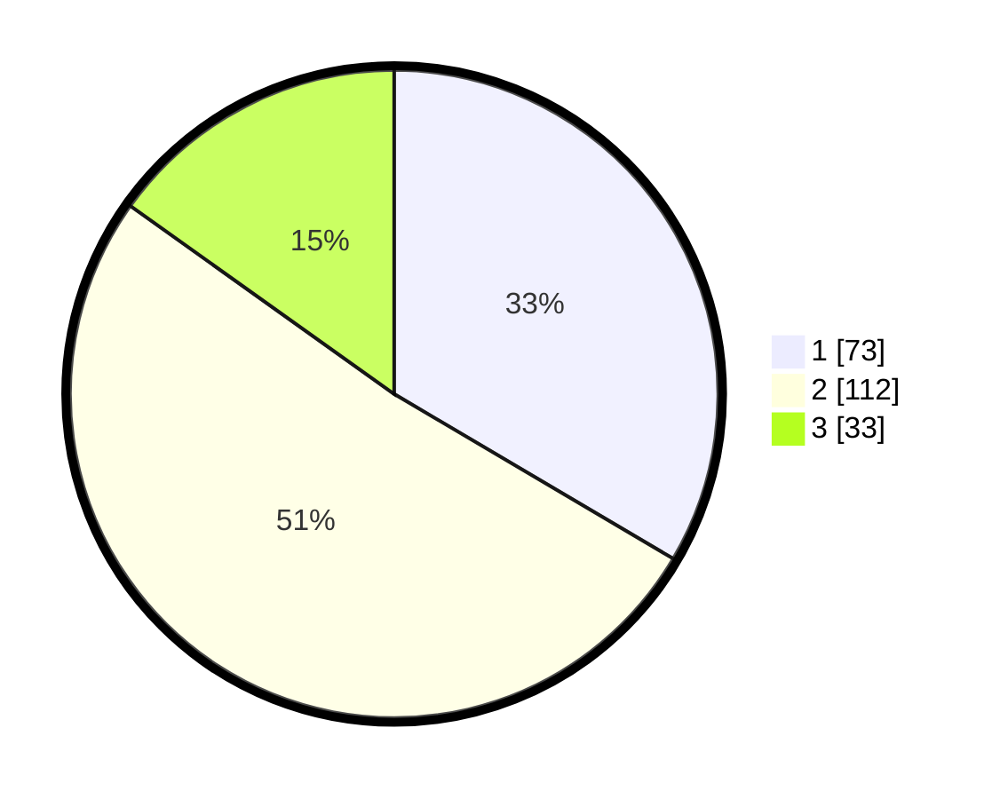

# Hasil

## Grafik

## Tabel

| No. | Nama Paslon    | Suara | Suara (raw) | Persentase |
|:--- |:-------------- | -----:| -----------:| ----------:|
| 1   | ANIES MUHAIMIN | 73    | [73][p-1]   | 33,49      |
| 2   | PRABOWO GIBRAN | 112   | [112][p-2]  | 51,38      |
| 3   | GANJAR MAHFUD  | 33    | [33][p-3]   | 15,14      |

[p-1]: https://github.com/gigit-pemilu/pemilu-2024/blob/main/pilpres/hitung-suara/sub/32-jawa-barat/sub/78-kota-tasikmalaya/sub/07-tamansari/sub/1001-tamansari/sub/005-tps/sub/paslon-1.txt
[p-2]: https://github.com/gigit-pemilu/pemilu-2024/blob/main/pilpres/hitung-suara/sub/32-jawa-barat/sub/78-kota-tasikmalaya/sub/07-tamansari/sub/1001-tamansari/sub/005-tps/sub/paslon-2.txt
[p-3]: https://github.com/gigit-pemilu/pemilu-2024/blob/main/pilpres/hitung-suara/sub/32-jawa-barat/sub/78-kota-tasikmalaya/sub/07-tamansari/sub/1001-tamansari/sub/005-tps/sub/paslon-3.txt

## Foto C Plano

https://sirekap-obj-formc.kpu.go.id/b199/pemilu/ppwp/32/78/07/10/01/3278071001005-20240215-155222--5e9f5cab-69b4-4df4-a287-42a96540b26f.jpg

https://sirekap-obj-formc.kpu.go.id/b199/pemilu/ppwp/32/78/07/10/01/3278071001005-20240215-155422--63fb902b-3ef9-492a-8abc-2c9969a72254.jpg

https://sirekap-obj-formc.kpu.go.id/b199/pemilu/ppwp/32/78/07/10/01/3278071001005-20240215-155727--c0ba7e1f-0d76-4bc1-aee1-15f10185e247.jpg

## Metadata

| Key        | Value               |
| ---------- | ------------------- |
| Time Stamp | 2024-02-20 18:00:00 |

