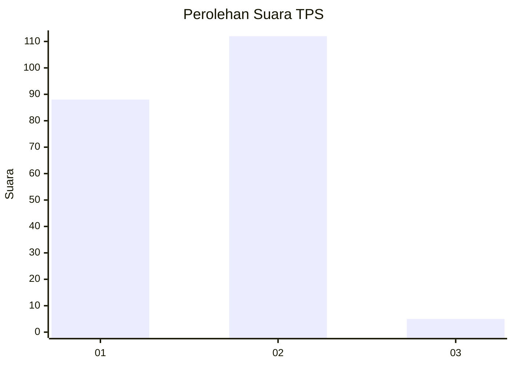
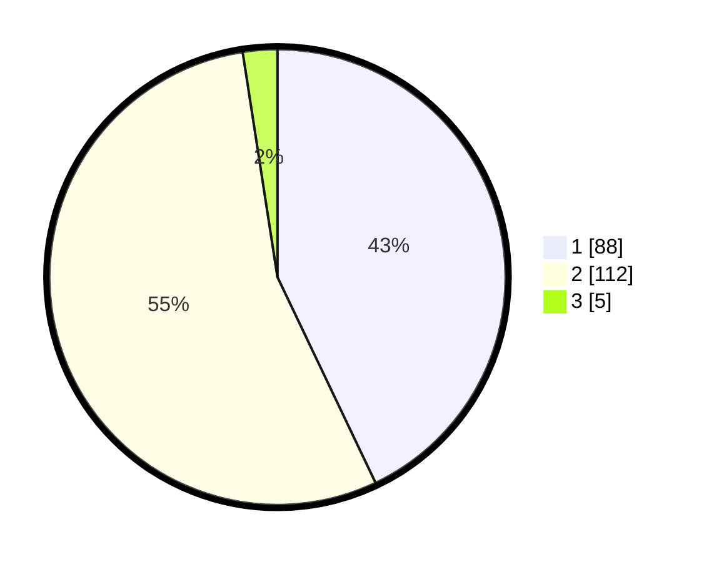

# Hasil

## Grafik

## Tabel

| No. | Nama Paslon    | Suara | Suara (raw) | Persentase |
|:--- |:-------------- | -----:| -----------:| ----------:|
| 1   | ANIES MUHAIMIN | 88    | [88][p-1]   | 42,93      |
| 2   | PRABOWO GIBRAN | 112   | [112][p-2]  | 54,63      |
| 3   | GANJAR MAHFUD  | 5     | [5][p-3]    | 2,44       |

[p-1]: https://github.com/gigit-pemilu/pemilu-2024-32-jawa-barat/blob/main/pilpres/hitung-suara/sub/32-jawa-barat/sub/78-kota-tasikmalaya/sub/08-mangkubumi/sub/1001-mangkubumi/sub/004-tps/sub/paslon-1.txt
[p-2]: https://github.com/gigit-pemilu/pemilu-2024-32-jawa-barat/blob/main/pilpres/hitung-suara/sub/32-jawa-barat/sub/78-kota-tasikmalaya/sub/08-mangkubumi/sub/1001-mangkubumi/sub/004-tps/sub/paslon-2.txt
[p-3]: https://github.com/gigit-pemilu/pemilu-2024-32-jawa-barat/blob/main/pilpres/hitung-suara/sub/32-jawa-barat/sub/78-kota-tasikmalaya/sub/08-mangkubumi/sub/1001-mangkubumi/sub/004-tps/sub/paslon-3.txt

## Foto C Plano

https://sirekap-obj-formc.kpu.go.id/b7e9/pemilu/ppwp/32/78/08/10/01/3278081001004-20240224-143025--90ea7f3a-2de7-44b6-a916-d6fe610b26ec.jpg

https://sirekap-obj-formc.kpu.go.id/b7e9/pemilu/ppwp/32/78/08/10/01/3278081001004-20240224-143056--4a2bd29e-c457-41a1-a815-123db61d9b9b.jpg

https://sirekap-obj-formc.kpu.go.id/b7e9/pemilu/ppwp/32/78/08/10/01/3278081001004-20240224-143250--20117983-6cf6-4952-8719-a386fc7097e8.jpg

## Metadata

| Key        | Value               |
| ---------- | ------------------- |
| Time Stamp | 2024-02-28 19:00:00 |

