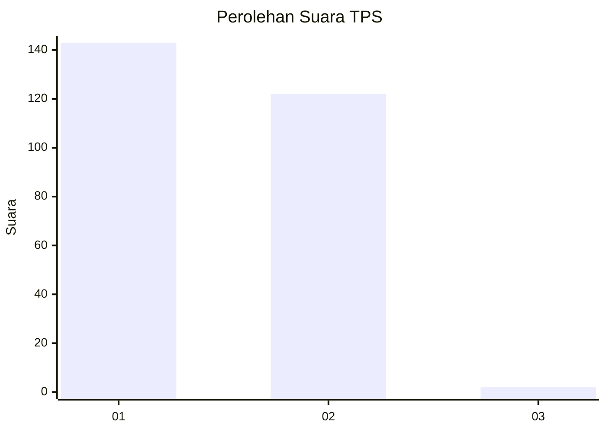
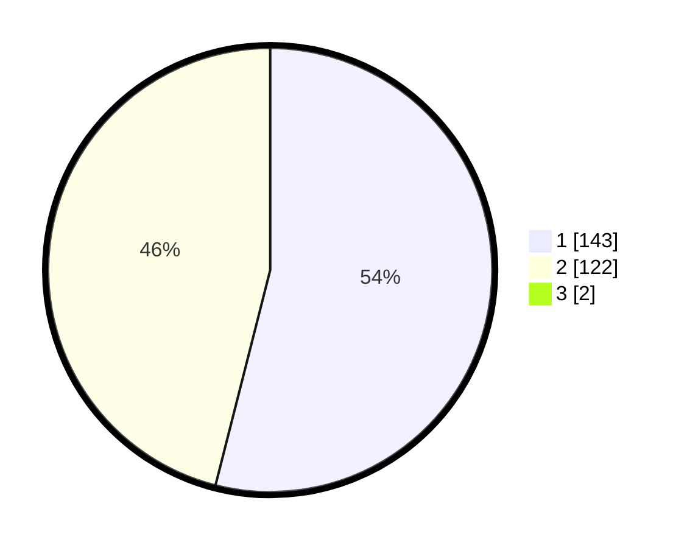

# Hasil

## Grafik

## Tabel

| No. | Nama Paslon    | Suara | Suara (raw) | Persentase |
|:--- |:-------------- | -----:| -----------:| ----------:|
| 1   | ANIES MUHAIMIN | 143   | [143][p-1]  | 53,56      |
| 2   | PRABOWO GIBRAN | 122   | [122][p-2]  | 45,69      |
| 3   | GANJAR MAHFUD  | 2     | [2][p-3]    | 0,75       |

[p-1]: https://github.com/gigit-pemilu/pemilu-2024/blob/main/pilpres/hitung-suara/sub/32-jawa-barat/sub/78-kota-tasikmalaya/sub/08-mangkubumi/sub/1001-mangkubumi/sub/039-tps/sub/paslon-1.txt
[p-2]: https://github.com/gigit-pemilu/pemilu-2024/blob/main/pilpres/hitung-suara/sub/32-jawa-barat/sub/78-kota-tasikmalaya/sub/08-mangkubumi/sub/1001-mangkubumi/sub/039-tps/sub/paslon-2.txt
[p-3]: https://github.com/gigit-pemilu/pemilu-2024/blob/main/pilpres/hitung-suara/sub/32-jawa-barat/sub/78-kota-tasikmalaya/sub/08-mangkubumi/sub/1001-mangkubumi/sub/039-tps/sub/paslon-3.txt

## Foto C Plano

https://sirekap-obj-formc.kpu.go.id/fbf9/pemilu/ppwp/32/78/08/10/01/3278081001039-20240215-042124--80eb9c2a-2008-4383-8030-e300b2cada83.jpg

https://sirekap-obj-formc.kpu.go.id/fbf9/pemilu/ppwp/32/78/08/10/01/3278081001039-20240215-042254--1d68a32e-ea31-495b-b17e-3b774f2b1ecf.jpg

https://sirekap-obj-formc.kpu.go.id/fbf9/pemilu/ppwp/32/78/08/10/01/3278081001039-20240215-042354--0d2d2e12-ecb3-4f0f-b76c-fe0a51549e45.jpg

## Metadata

| Key        | Value               |
| ---------- | ------------------- |
| Time Stamp | 2024-02-20 20:00:00 |

