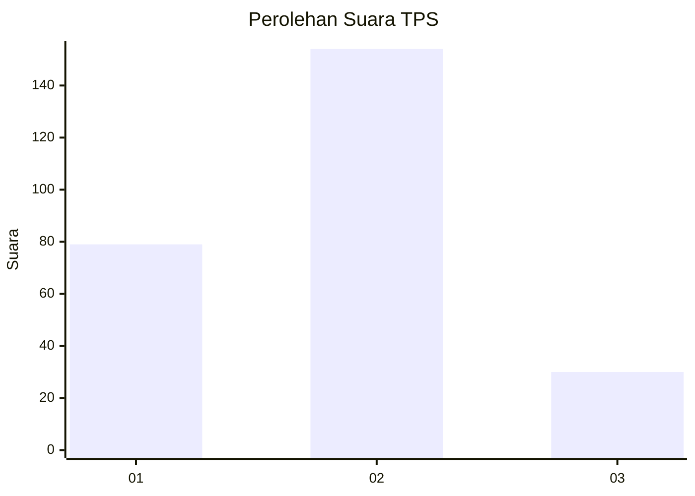
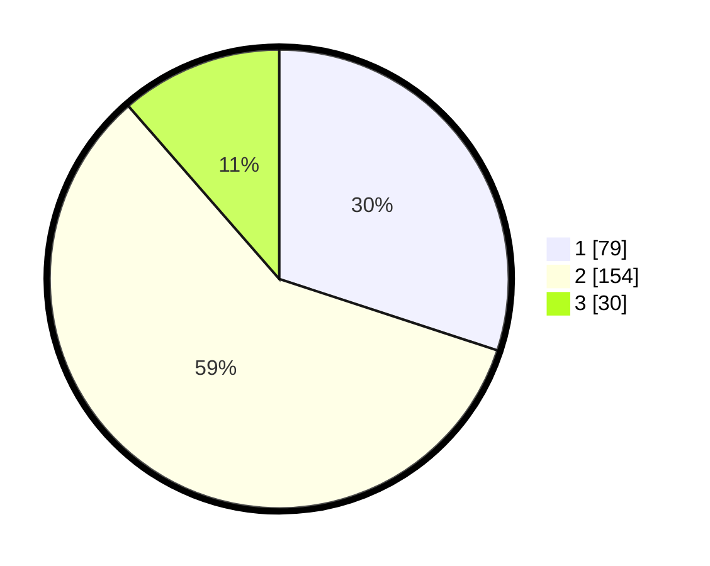

# Hasil

## Grafik

## Tabel

| No. | Nama Paslon    | Suara | Suara (raw) | Persentase |
|:--- |:-------------- | -----:| -----------:| ----------:|
| 1   | ANIES MUHAIMIN | 79    | [79][p-1]   | 30,04      |
| 2   | PRABOWO GIBRAN | 154   | [154][p-2]  | 58,56      |
| 3   | GANJAR MAHFUD  | 30    | [30][p-3]   | 11,41      |

[p-1]: https://github.com/gigit-pemilu/pemilu-2024/blob/main/pilpres/hitung-suara/sub/32-jawa-barat/sub/78-kota-tasikmalaya/sub/08-mangkubumi/sub/1006-sambongpari/sub/004-tps/sub/paslon-1.txt
[p-2]: https://github.com/gigit-pemilu/pemilu-2024/blob/main/pilpres/hitung-suara/sub/32-jawa-barat/sub/78-kota-tasikmalaya/sub/08-mangkubumi/sub/1006-sambongpari/sub/004-tps/sub/paslon-2.txt
[p-3]: https://github.com/gigit-pemilu/pemilu-2024/blob/main/pilpres/hitung-suara/sub/32-jawa-barat/sub/78-kota-tasikmalaya/sub/08-mangkubumi/sub/1006-sambongpari/sub/004-tps/sub/paslon-3.txt

## Foto C Plano

https://sirekap-obj-formc.kpu.go.id/fcff/pemilu/ppwp/32/78/08/10/06/3278081006004-20240215-053318--1e355f28-54cf-44fb-9d5a-29daf030eddd.jpg

https://sirekap-obj-formc.kpu.go.id/fcff/pemilu/ppwp/32/78/08/10/06/3278081006004-20240215-073243--c31266fc-c81d-450a-bf66-05c999a6dc3d.jpg

https://sirekap-obj-formc.kpu.go.id/fcff/pemilu/ppwp/32/78/08/10/06/3278081006004-20240215-073431--44b8d934-a569-420c-af37-4c17155f5da8.jpg

## Metadata

| Key        | Value               |
| ---------- | ------------------- |
| Time Stamp | 2024-02-20 18:00:00 |

