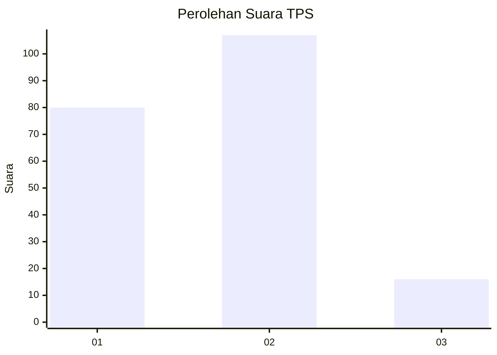
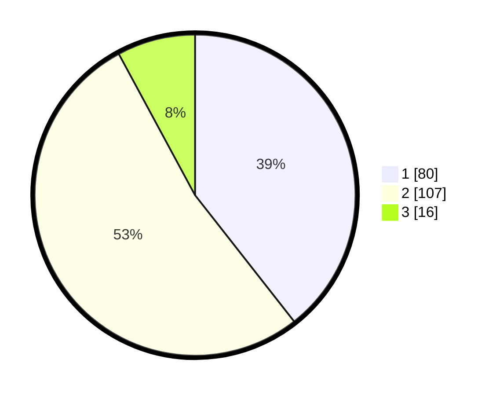

# Hasil

## Grafik

## Tabel

| No. | Nama Paslon    | Suara | Suara (raw) | Persentase |
|:--- |:-------------- | -----:| -----------:| ----------:|
| 1   | ANIES MUHAIMIN | 80    | [80][p-1]   | 39,41      |
| 2   | PRABOWO GIBRAN | 107   | [107][p-2]  | 52,71      |
| 3   | GANJAR MAHFUD  | 16    | [16][p-3]   | 7,88       |

[p-1]: https://github.com/gigit-pemilu/pemilu-2024/blob/main/pilpres/hitung-suara/sub/32-jawa-barat/sub/78-kota-tasikmalaya/sub/09-bungursari/sub/1001-sukamulya/sub/004-tps/sub/paslon-1.txt
[p-2]: https://github.com/gigit-pemilu/pemilu-2024/blob/main/pilpres/hitung-suara/sub/32-jawa-barat/sub/78-kota-tasikmalaya/sub/09-bungursari/sub/1001-sukamulya/sub/004-tps/sub/paslon-2.txt
[p-3]: https://github.com/gigit-pemilu/pemilu-2024/blob/main/pilpres/hitung-suara/sub/32-jawa-barat/sub/78-kota-tasikmalaya/sub/09-bungursari/sub/1001-sukamulya/sub/004-tps/sub/paslon-3.txt

## Foto C Plano

https://sirekap-obj-formc.kpu.go.id/5ffa/pemilu/ppwp/32/78/09/10/01/3278091001004-20240215-071214--e59992e3-03c9-4a74-bebb-07e4335ad74a.jpg

https://sirekap-obj-formc.kpu.go.id/5ffa/pemilu/ppwp/32/78/09/10/01/3278091001004-20240216-215939--4161475c-a832-432b-85bd-e5dcaf2dc8d2.jpg

https://sirekap-obj-formc.kpu.go.id/5ffa/pemilu/ppwp/32/78/09/10/01/3278091001004-20240215-124241--b0f04c99-45ff-4756-9048-2635c21fa601.jpg

## Metadata

| Key        | Value               |
| ---------- | ------------------- |
| Time Stamp | 2024-02-16 22:01:00 |

