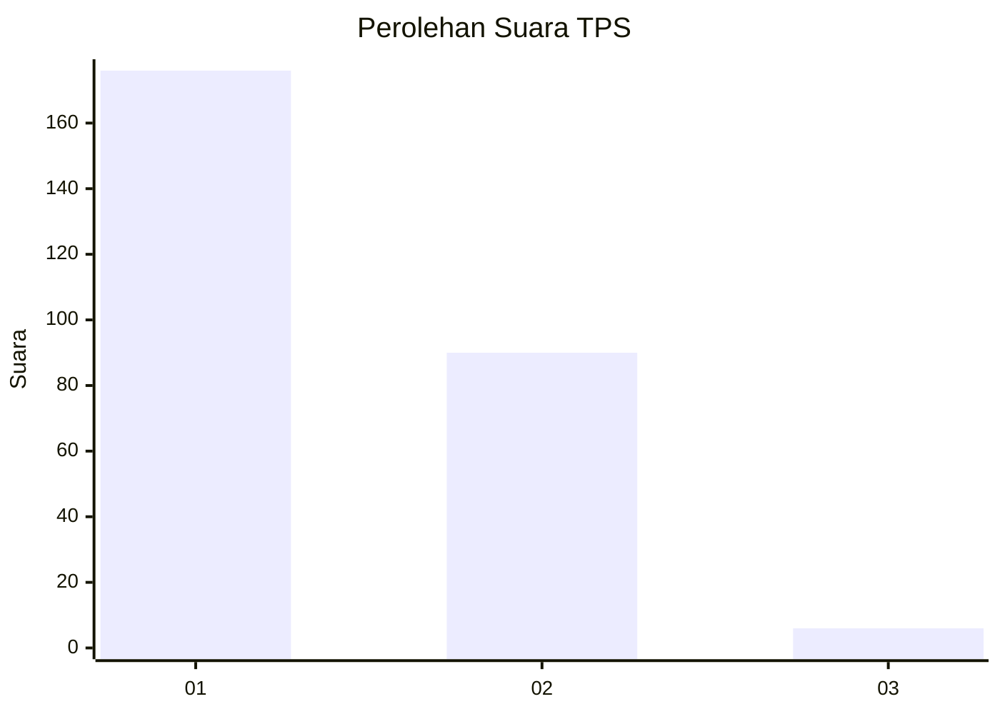
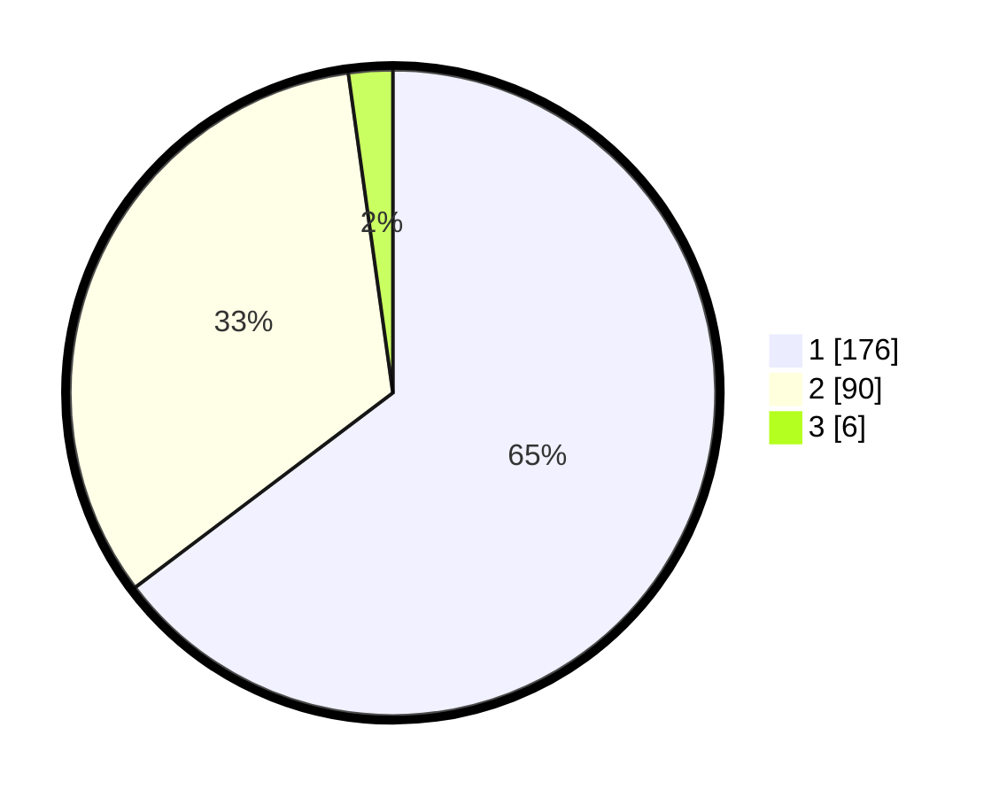

# Hasil

## Grafik

## Tabel

| No. | Nama Paslon    | Suara | Suara (raw) | Persentase |
|:--- |:-------------- | -----:| -----------:| ----------:|
| 1   | ANIES MUHAIMIN | 176   | [176][p-1]  | 64,71      |
| 2   | PRABOWO GIBRAN | 90    | [90][p-2]   | 33,09      |
| 3   | GANJAR MAHFUD  | 6     | [6][p-3]    | 2,21       |

[p-1]: https://github.com/gigit-pemilu/pemilu-2024/blob/main/pilpres/hitung-suara/sub/32-jawa-barat/sub/78-kota-tasikmalaya/sub/09-bungursari/sub/1006-bantarsari/sub/025-tps/sub/paslon-1.txt
[p-2]: https://github.com/gigit-pemilu/pemilu-2024/blob/main/pilpres/hitung-suara/sub/32-jawa-barat/sub/78-kota-tasikmalaya/sub/09-bungursari/sub/1006-bantarsari/sub/025-tps/sub/paslon-2.txt
[p-3]: https://github.com/gigit-pemilu/pemilu-2024/blob/main/pilpres/hitung-suara/sub/32-jawa-barat/sub/78-kota-tasikmalaya/sub/09-bungursari/sub/1006-bantarsari/sub/025-tps/sub/paslon-3.txt

## Foto C Plano

https://sirekap-obj-formc.kpu.go.id/6997/pemilu/ppwp/32/78/09/10/06/3278091006025-20240215-010041--eae8949a-57eb-4797-ac82-61947dc336f9.jpg

https://sirekap-obj-formc.kpu.go.id/6997/pemilu/ppwp/32/78/09/10/06/3278091006025-20240215-055153--cc2492d7-00c1-45c6-86ec-978a13cd04c4.jpg

https://sirekap-obj-formc.kpu.go.id/6997/pemilu/ppwp/32/78/09/10/06/3278091006025-20240215-055030--24dfa84d-1b3a-43c2-9faf-42dc29ac6485.jpg

## Metadata

| Key        | Value               |
| ---------- | ------------------- |
| Time Stamp | 2024-02-20 19:00:00 |

