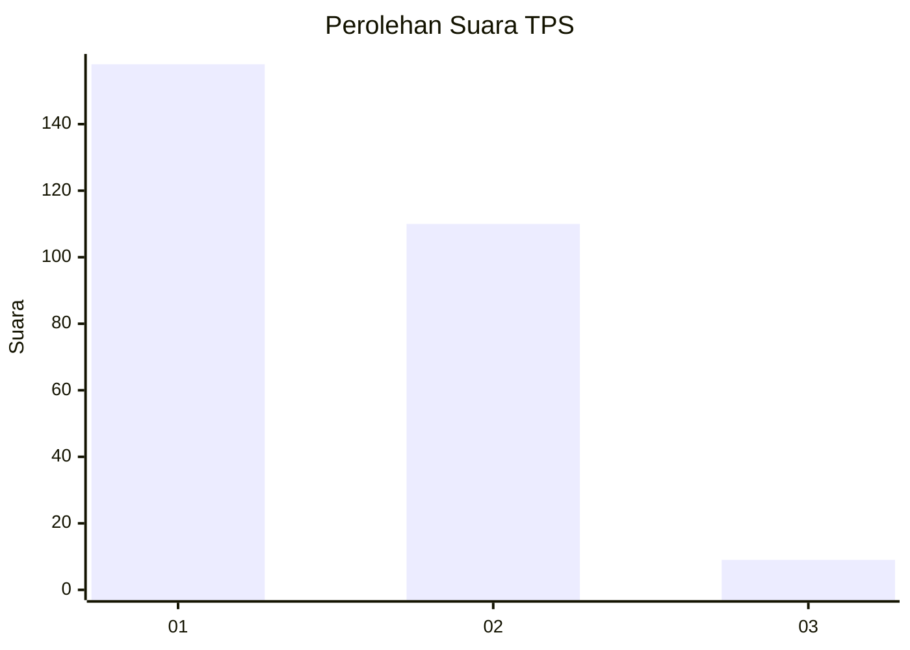
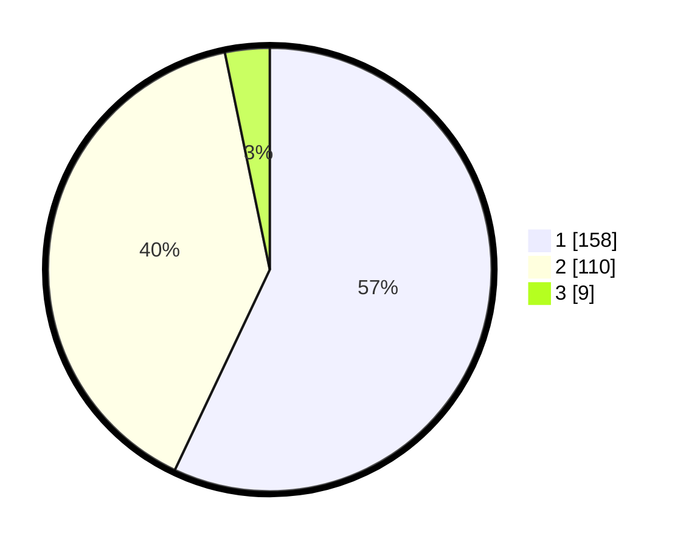

# Hasil

## Grafik

## Tabel

| No. | Nama Paslon    | Suara | Suara (raw) | Persentase |
|:--- |:-------------- | -----:| -----------:| ----------:|
| 1   | ANIES MUHAIMIN | 158   | [158][p-1]  | 57,04      |
| 2   | PRABOWO GIBRAN | 110   | [110][p-2]  | 39,71      |
| 3   | GANJAR MAHFUD  | 9     | [9][p-3]    | 3,25       |

[p-1]: https://github.com/gigit-pemilu/pemilu-2024-32-jawa-barat/blob/main/pilpres/hitung-suara/sub/32-jawa-barat/sub/78-kota-tasikmalaya/sub/09-bungursari/sub/1006-bantarsari/sub/030-tps/sub/paslon-1.txt
[p-2]: https://github.com/gigit-pemilu/pemilu-2024-32-jawa-barat/blob/main/pilpres/hitung-suara/sub/32-jawa-barat/sub/78-kota-tasikmalaya/sub/09-bungursari/sub/1006-bantarsari/sub/030-tps/sub/paslon-2.txt
[p-3]: https://github.com/gigit-pemilu/pemilu-2024-32-jawa-barat/blob/main/pilpres/hitung-suara/sub/32-jawa-barat/sub/78-kota-tasikmalaya/sub/09-bungursari/sub/1006-bantarsari/sub/030-tps/sub/paslon-3.txt

## Foto C Plano

https://sirekap-obj-formc.kpu.go.id/ac2c/pemilu/ppwp/32/78/09/10/06/3278091006030-20240215-103102--3c23645b-a3eb-41b5-804e-876536e74f25.jpg

https://sirekap-obj-formc.kpu.go.id/ac2c/pemilu/ppwp/32/78/09/10/06/3278091006030-20240215-102753--01d29b85-60d2-42fd-b8f6-17d424f4ab26.jpg

https://sirekap-obj-formc.kpu.go.id/ac2c/pemilu/ppwp/32/78/09/10/06/3278091006030-20240215-104424--667b72f2-72d4-4490-9326-fb48ddc58db7.jpg

## Metadata

| Key        | Value               |
| ---------- | ------------------- |
| Time Stamp | 2024-02-20 20:00:00 |

