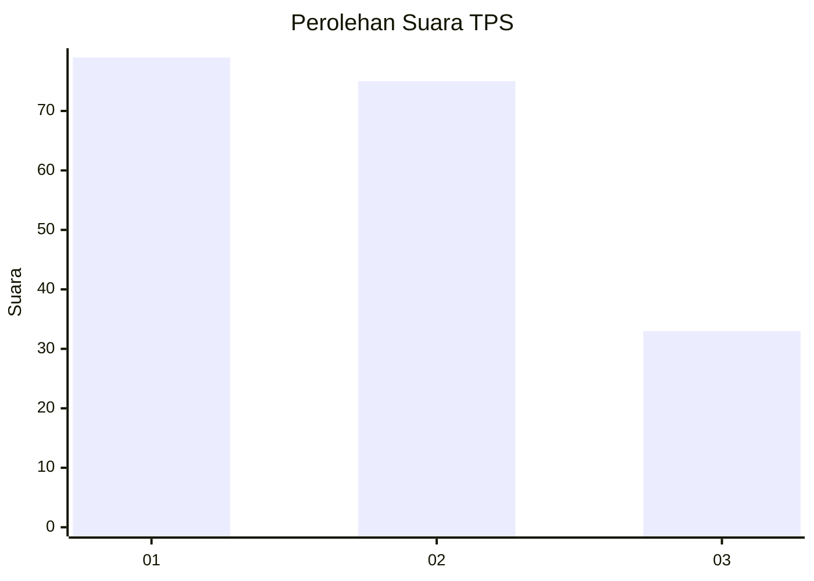
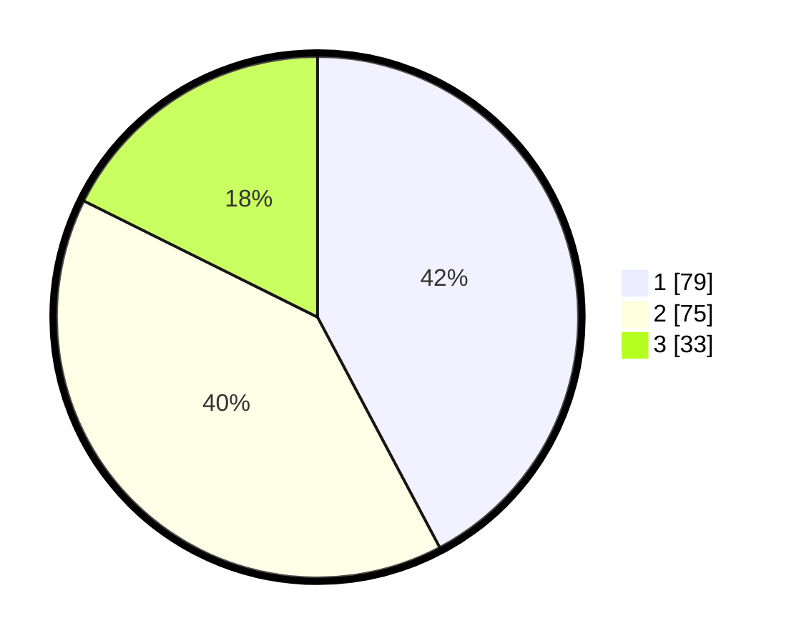

# Hasil

## Grafik

## Tabel

| No. | Nama Paslon    | Suara | Suara (raw) | Persentase |
|:--- |:-------------- | -----:| -----------:| ----------:|
| 1   | ANIES MUHAIMIN | 79    | [79][p-1]   | 42,25      |
| 2   | PRABOWO GIBRAN | 75    | [75][p-2]   | 40,11      |
| 3   | GANJAR MAHFUD  | 33    | [33][p-3]   | 17,65      |

[p-1]: https://github.com/gigit-pemilu/pemilu-2024/blob/main/pilpres/hitung-suara/sub/32-jawa-barat/sub/79-kota-banjar/sub/02-pataruman/sub/1001-hegarsari/sub/002-tps/sub/paslon-1.txt
[p-2]: https://github.com/gigit-pemilu/pemilu-2024/blob/main/pilpres/hitung-suara/sub/32-jawa-barat/sub/79-kota-banjar/sub/02-pataruman/sub/1001-hegarsari/sub/002-tps/sub/paslon-2.txt
[p-3]: https://github.com/gigit-pemilu/pemilu-2024/blob/main/pilpres/hitung-suara/sub/32-jawa-barat/sub/79-kota-banjar/sub/02-pataruman/sub/1001-hegarsari/sub/002-tps/sub/paslon-3.txt

## Foto C Plano

https://sirekap-obj-formc.kpu.go.id/adda/pemilu/ppwp/32/79/02/10/01/3279021001002-20240216-140923--f03e9dc8-fc54-4c21-844e-421c7e78c0ef.jpg

https://sirekap-obj-formc.kpu.go.id/adda/pemilu/ppwp/32/79/02/10/01/3279021001002-20240216-141536--0e8cc9aa-72e9-4e48-ad44-3d0c8eb7caac.jpg

https://sirekap-obj-formc.kpu.go.id/adda/pemilu/ppwp/32/79/02/10/01/3279021001002-20240216-141231--a25ec2fc-6085-4fbd-80e5-8562005dc45f.jpg

## Metadata

| Key        | Value               |
| ---------- | ------------------- |
| Time Stamp | 2024-02-16 23:00:00 |

