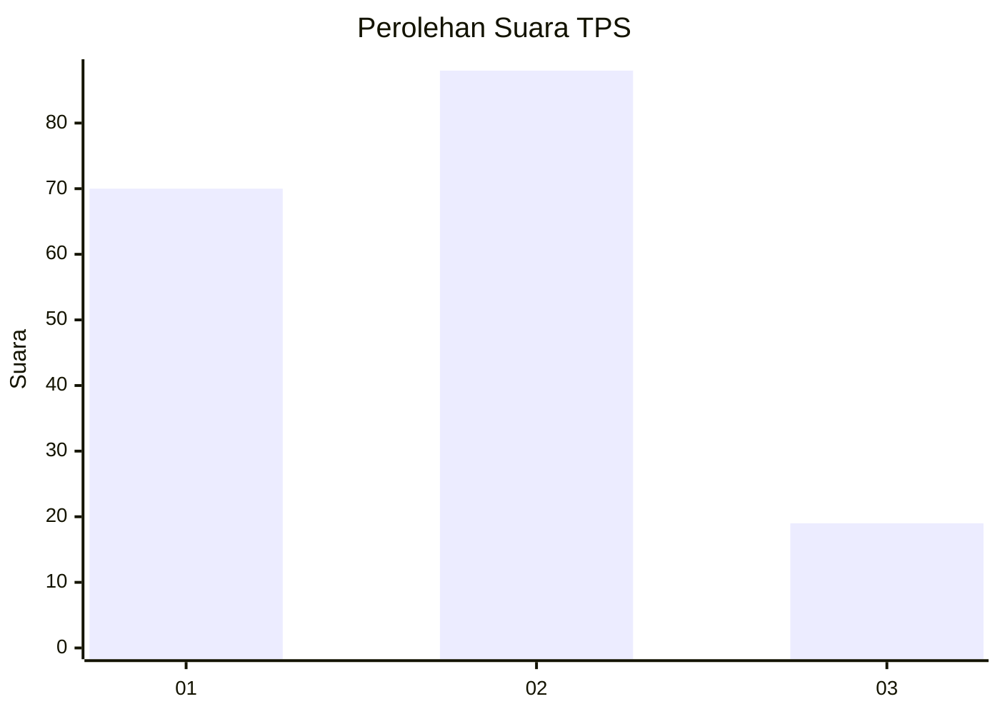
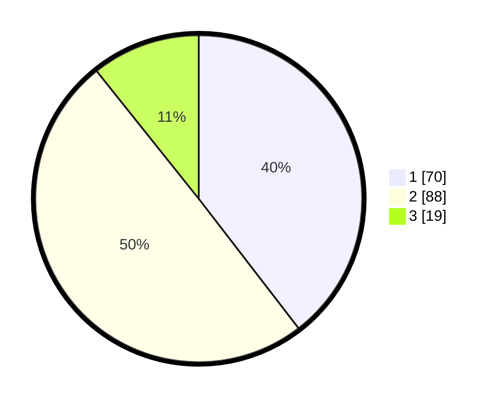

# Hasil

## Grafik

## Tabel

| No. | Nama Paslon    | Suara | Suara (raw) | Persentase |
|:--- |:-------------- | -----:| -----------:| ----------:|
| 1   | ANIES MUHAIMIN | 70    | [70][p-1]   | 39,55      |
| 2   | PRABOWO GIBRAN | 88    | [88][p-2]   | 49,72      |
| 3   | GANJAR MAHFUD  | 19    | [19][p-3]   | 10,73      |

[p-1]: https://github.com/gigit-pemilu/pemilu-2024/blob/main/pilpres/hitung-suara/sub/32-jawa-barat/sub/79-kota-banjar/sub/02-pataruman/sub/1001-hegarsari/sub/007-tps/sub/paslon-1.txt
[p-2]: https://github.com/gigit-pemilu/pemilu-2024/blob/main/pilpres/hitung-suara/sub/32-jawa-barat/sub/79-kota-banjar/sub/02-pataruman/sub/1001-hegarsari/sub/007-tps/sub/paslon-2.txt
[p-3]: https://github.com/gigit-pemilu/pemilu-2024/blob/main/pilpres/hitung-suara/sub/32-jawa-barat/sub/79-kota-banjar/sub/02-pataruman/sub/1001-hegarsari/sub/007-tps/sub/paslon-3.txt

## Foto C Plano

https://sirekap-obj-formc.kpu.go.id/78c8/pemilu/ppwp/32/79/02/10/01/3279021001007-20240215-185349--6a06cfe4-cdae-4c6c-8e47-2e04898e37e3.jpg

https://sirekap-obj-formc.kpu.go.id/78c8/pemilu/ppwp/32/79/02/10/01/3279021001007-20240215-185404--772917c3-4ed5-408a-8252-fc6c742e88fb.jpg

https://sirekap-obj-formc.kpu.go.id/78c8/pemilu/ppwp/32/79/02/10/01/3279021001007-20240216-142939--fcfdff94-763e-44be-bd3a-c040aa7c1d42.jpg

## Metadata

| Key        | Value               |
| ---------- | ------------------- |
| Time Stamp | 2024-02-20 17:00:00 |

